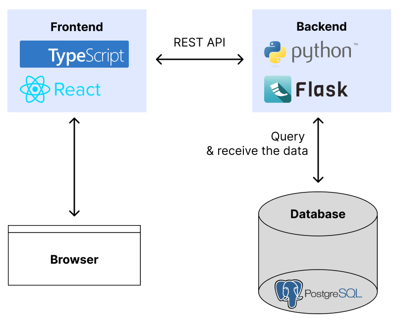

# PredictPal

## Project architecture

## Project boilerplate & How to run

This project was created using 4geeksacademy React JS x Flask API boilerplate. You can find a comprehensive documentation about this boilerplate here: [https://start.4geeksacademy.com/starters/full-stack](https://start.4geeksacademy.com/starters/full-stack).

Please follow the instruction [here](https://github.com/4GeeksAcademy/react-flask-hello/blob/main/README.md) to set the project up for the first run.
